# Repo: Reconhecimento Facial e Transformação de Imagens em Dados no Azure ML
### Objetivo

Repositório criado para entregar o projeto final da etapa: Reconhecimento Facial e Transformação de Imagens em Dados no Azure ML

# Requerimentos do projeto
### Como Entregar esse projeto?

Chegou a hora de você construir um portfólio ainda mais rico e impressionar futuros recrutadores, para isso é sempre importante mostrar os resultados do seu esforço e como você os obteve deixando claro o seu racional, para isso faça da seguinte maneira:

1. Crie um novo repositório no github com um nome a sua preferência
2. Crie uma pasta chamada 'inputs' e salve as imagens que você utilizou
3. Crie uma pasta chamado 'output' e salve os resultados de reconhecimento de texto nessas imagens
4. Crie um arquivo chamado readme.md , deixe alguns prints descreva o processo, alguns insights e possibilidades que você aprendeu durante o conteúdo.
5. Compartilhe conosco o link desse repositório através do botão 'entregar projeto'

# Links úteis

https://aka.ms/ai900-face<br>
https://aka.ms/ai900-ocr<br>
https://aka.ms/ai900-image-analysis

# Crie um arquivo chamado readme.md, deixe alguns prints, descreva o processo, alguns insights e possibilidades que você aprendeu durante o conteúdo.

#### Insights e possibilidades

As tecnologias apresentadas aqui já estão em uso no mundo todo, de diversas formas. A influência da IA ​​é omnipresente. Nesse processo eu busco identificar as inúmeras maneiras de aproveitar os serviços disponíveis no Azure para inteligência artificial.

Os primeiros insights que tive foi utilizar a IA para cuidar do lar. Imagine você receber notificações sobre o comportamento do seu pet ou das pessoas na sua casa. Combinando isso às tecnologias de IoT, você poderá ter um grande controle mesmo fora de casa. Você pode evitar acidentes observando o comportamento das coisas, oferecer serviços remotos de cuidados para o Pet, idosos e pessoas com comorbidades. Tudo isso baseado na captura de informações em tempo real com respostas rápidas.

Outra coisa que chama atenção é a qualidade da transcrição dos textos de imagens. OCR existe há alguns anos, mas a evolução dessa tecnologia pode ajudar pessoas com deficiência visual a interpretar o visual com rapidez.

#### O processo

Após criar um recurso **Azure AI service**, acesse o [Vision Studio](https://portal.vision.cognitive.azure.com/?azure-portal=true) para ter acesso às três tecnologias que vamos utilizar nos exemplos abaixo:

* **Detect Faces in an image**
    * Detecte a localização de um ou mais rostos humanos em imagens, juntamente com atributos como pose, máscara facial e pontos de referência faciais.
* **Add captions to images**
    * Gere uma frase legível que descreva o conteúdo de uma imagem.
* **Extract text from images**
    * Use a API Read para extrair texto impresso e manuscrito em idiomas suportados de imagens, PDFs e arquivos TIFF. O recurso de reconhecimento óptico de caracteres (OCR) oferece suporte a imagens e documentos com idiomas mistos e não exige a especificação do idioma.

### Detect Faces in an image

| Imagem de Input | Output |
|:--------:|:--------:|
||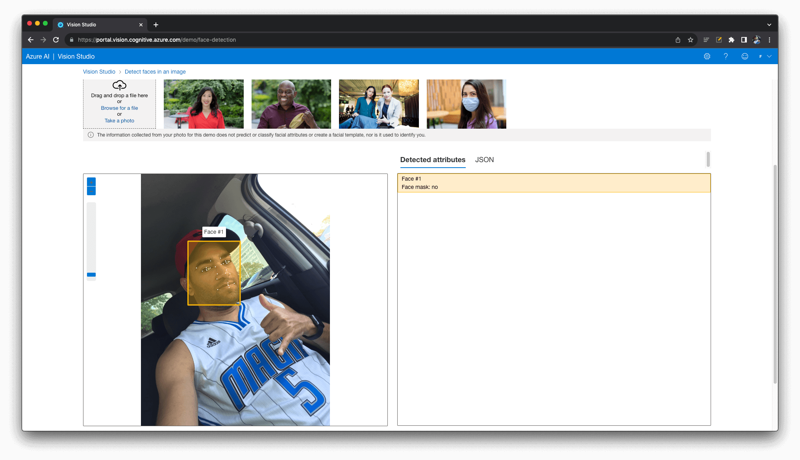|

Nessa imagem simples, observam-se os pontos de captura começando pelo quadrado do rosto, depois os pontos na sobrancelha, olhos, nariz  e boca. Tudo isso é capturado em pequenos pontos e enviados para uma API. Observe um trecho de código JSON:

```json
[
  {
    "recognitionModel": "recognition_01",
    "faceRectangle": {
      "width": 212,
      "height": 259,
      "left": 191,
      "top": 274
    },
    "faceLandmarks": {
      "pupilLeft": {
        "x": 265.8,
        "y": 387.5
      },
      "pupilRight": {
        "x": 346.2,
        "y": 358.9
      },
```

| Imagem de Input | Output |
|:--------:|:--------:|
|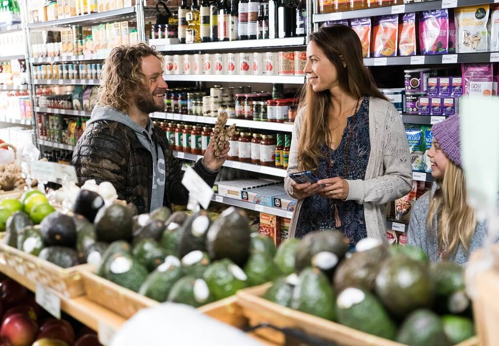|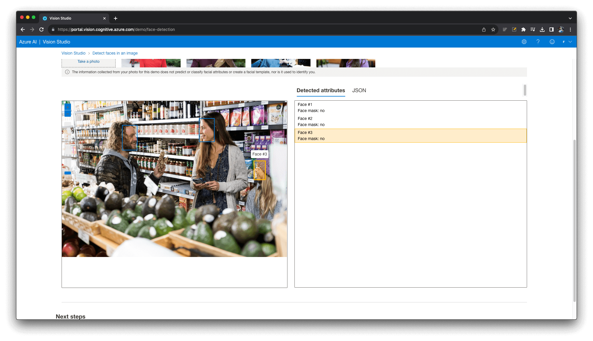|

Observe que foi possível detectar o rosto da garotinha usando touca. A saída ainda incluir a informação do uso de máscara facial como um atributo.

### Add captions to images

| Imagem de Input | Output |
|:--------:|:--------:|
|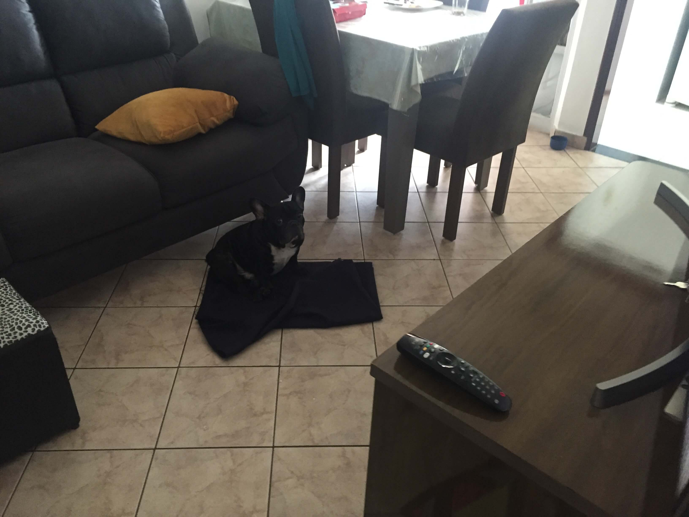|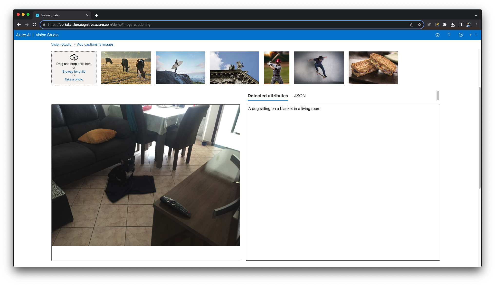|

Essa foto da sala do meu apartamento é impressionante. Foi possível detectar o meu bulldog francês que é preto sobre a sombra da mesa em fundo cinza-escuro do sofá. A IA detectou que o cachorro está sobre o **cobertor** (e aquilo é um cobertor 😱) em uma sala de estar.

| Imagem de Input | Output |
|:--------:|:--------:|
|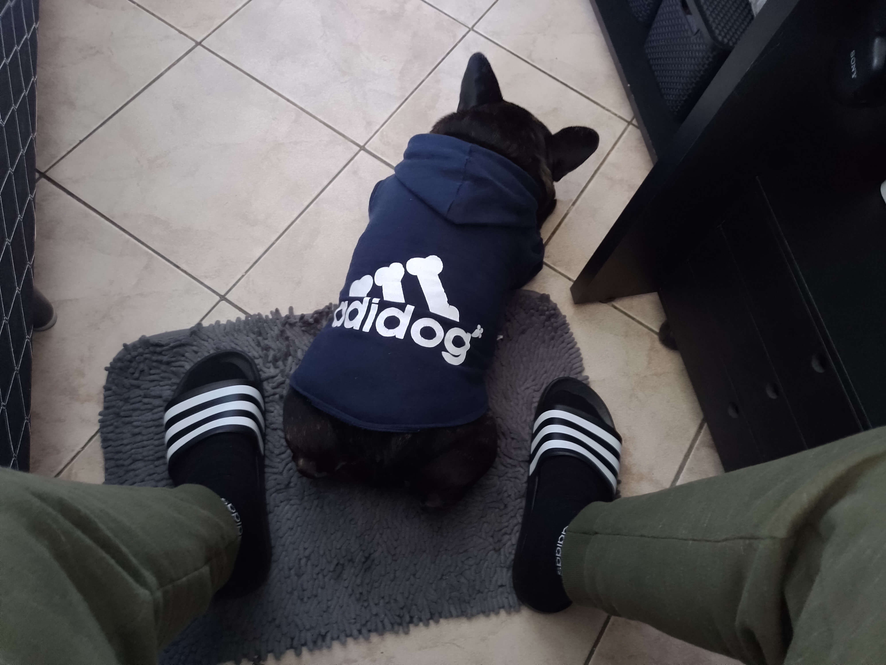|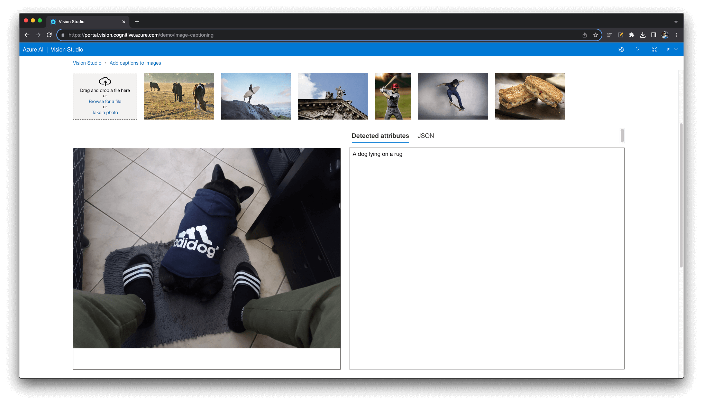|

Nessa foto eu desafiei a IA a identificar o meu bulldog francês de costas, deitado usando a roupinha dele 🤣. Me chamou a atenção o fato da IA diferenciar os tipos de tecido como foi o primeiro caso, um coberto, e agora, um tapete.

### Extract text from images

| Imagem de Input | Output |
|:--------:|:--------:|
|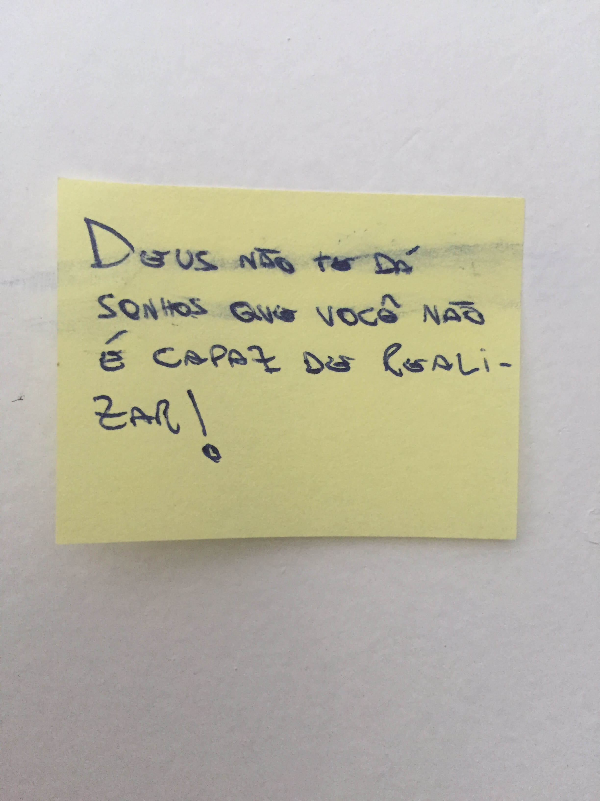|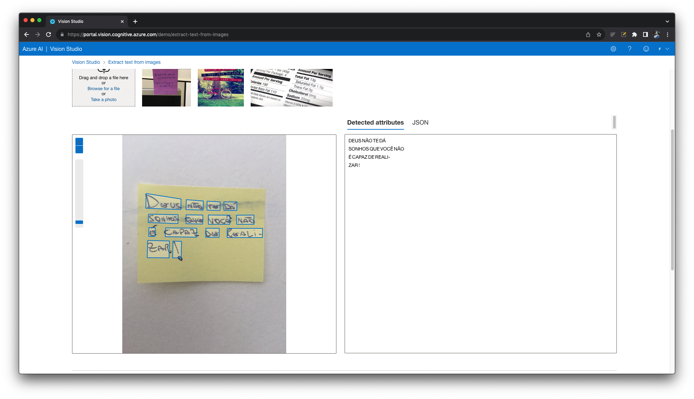|

A captura é tão perfeita que mesmo a mancha da tinta sobre as letras (e a minha letra feia) não evitou a perfeição. Vale ressaltar que ela incluiu o hífen de quebra de linha e não completou a palavra, mas nada que não se resolva no código.

| Imagem de Input | Output |
|:--------:|:--------:|
|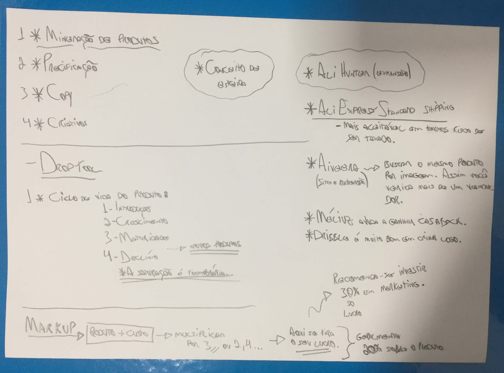|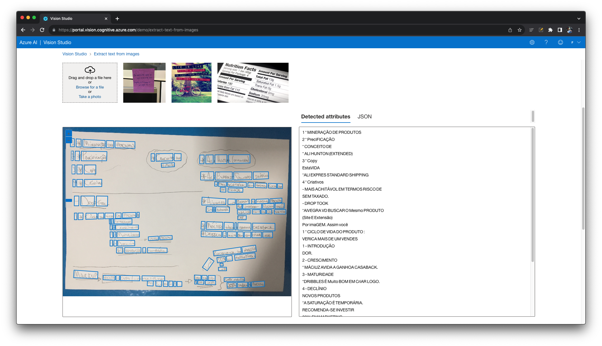|

Um verdadeiro desafio para a IA, identificar todas as palavras nesse resumo, bem desorganizado, com letras quase impossíveis de serem decifradas, escrito à lapiseira, que eu fiz de um vídeo sobre o assunto dropshipping. Ela foi capaz de detectar todas as palavras, incluindo case sensitive e caracteres especiais como é o caso do hífen (-) e do asterisco (*). Porém outras palavras ela detectou errado. Mesmo assim muito impressionante os resultados.